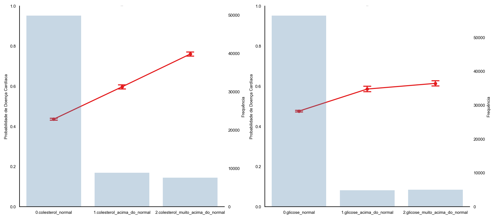
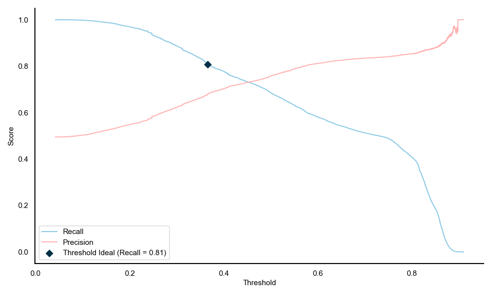
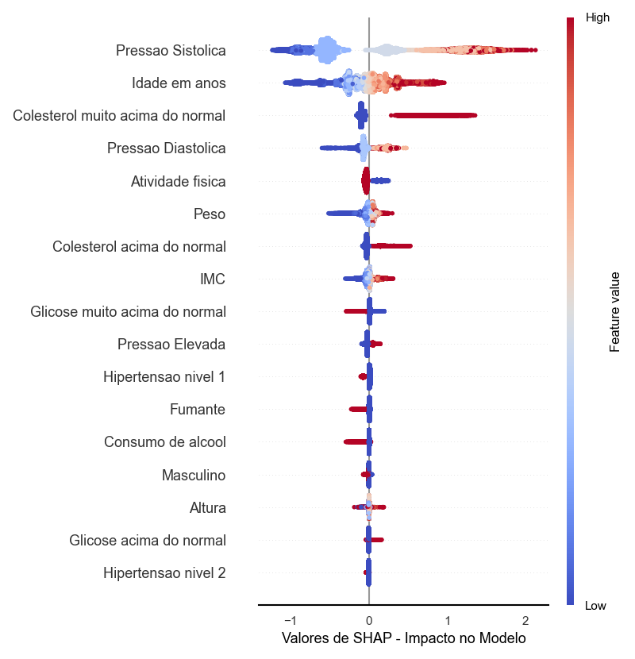

# cardio-ml-prediction

Este projeto tem como objetivo desenvolver e avaliar modelos preditivos para a ocorrência de doenças cardíacas utilizando dados abertos, com ênfase na identificação das variáveis mais influentes na sua previsão. Ele faz parte do Trabalho de Conclusão de Curso do MBA em Ciência de Dados da USP/Esalq.

Este tema surgiu em minha vida por diferentes motivos, onde culminaram no período de conclusão do curso em Data Science. A ideia inicial está relacionada a desafios enfrentados dentro de uma empresa de Seguros de Vida, onde nossa maior dificuldade era entender o risco atrelado a um potencial cliente de acordo seu histórico médico. O entendimento dessas circunstâncias são essencial para a precificação e aceite do risco. 

O outro motivador é de cunho pessoal, já que possuo em minha família uma pessoa que possui doença cardíaca e sua previsão seria um fator crucial para o tratamento. 

Além do objetivo central do trabalho ser a escolha dos melhores algoritmos para previsão e entender o impacto de cada variável, é de suma importância relembrar que este projeto só existe para que possamos auxiliar na previsão e tomada de decisão para cada tipo de grupo de risco, seja por intervenção ou a necessidade de novos exames.

Os dados utilizados são uma consolidação de duas bases:
* ["UCI Machine Learning Repository - Heart Disease Dataset"](https://archive.ics.uci.edu/dataset/45/heart+disease)
* ["Kaggle - Heart Disease Dataset by YasserH"](https://www.kaggle.com/datasets/yasserh/heart-disease-dataset)

---

## Estrutura do Projeto

A estrutura do projeto visa a modularidade e reprodutibilidade por qualquer pessoa que queira realizar suas previsões sobre esta base de dados ou outras. 
Portanto, está dividido em pastas que possuem diferentes propósitos que são autoexplicados em seus nomes.

A pasta `src` é onde estão as principais etapas de análise exploratória, transformação dos dados, treinamento, avaliação dos modelos e interpretabilidade.


---

## Tecnologias Utilizadas

- Python 3.10+
- Pandas, NumPy
- Seaborn & Matplotlib
- Scikit-learn
- XGBoost
- CatBoost
- Optuna 
- SHAP

---

## Modelos Implementados

- Regressão Logística
- Decision Tree
- Random Forest
- XGBoost
- CatBoost
- Adaboost

---

## Avaliação dos Modelos

As seguintes métricas são utilizadas para avaliar a performance dos modelos:

- **Acurácia**
- **Precisão**
- **Recall**
- **F1-Score**
- **Área sob a Curva ROC (AUC-ROC)**
- **Matriz de confusão**

As métricas utilizadas foram selecionadas por fornecerem uma visão abrangente do desempenho dos modelos, especialmente em contextos com possível desbalanceamento de classes, como é comum em diagnósticos médicos.

---

## Interpretabilidade com SHAP

A análise de explicabilidade dos modelos é feita com **SHAP (Shapley Additive Explanations)**, permitindo:
- Visualizar o impacto de cada variável na predição
- Identificar os atributos mais importantes
- Aumentar a transparência e a confiança no modelo

O SHAP (Shapley Additive Explanations) foi escolhido por ser um dos métodos mais robustos e interpretáveis para explicar predições de modelos de machine learning. Ele se baseia na teoria dos jogos para atribuir a cada variável a sua real contribuição para a predição, oferecendo explicações consistentes e localmente precisas, mesmo em modelos complexos como árvores de decisão ou ensembles. Isso permite compreender o "porquê" por trás das decisões do modelo, aumentando a confiança e a transparência (aspectos fundamentais em aplicações na área da saúde).

---

## Como Executar o Projeto

### 1. Clone o repositório

```bash
git clone https://github.com/seu-usuario/heart-disease-prediction.git <nome-da-pasta>
cd <nome-da-pasta>
```

### 2. Instale os pacotes e Dependências

```bash
pip install -r requirements.txt
```

### 3. Execute o pipeline completo

```bash
python config.py
python preprocessing.py
python eda.py
python train.py
python predict.py
```

## Dataset

Nomes e conteúdo de variáveis foram substituídos para o português, para que seja mais clara sua interpretabilidade para pessoas leigas no assunto. A versão original pode ser encontrada nos links disponibilizados e o script de transformação na pasta `src`.

**Variáveis:**
* paciente_id: Identificador único de cada paciente.
* nr_dias_idade: Idade do paciente em dias.
* nr_anos_idade: Idade do paciente em anos (derivada da variável "age").
* cat_genero: Gênero do paciente - Variável categórica (1: Feminino, 2: Masculino).
* vlr_altura: Altura do paciente em centímetros.
* vlr_peso: Peso do paciente em kilogramas.
* vlr_pressao_sistolica: Pressão arterial Sistólica.
    * A pressão arterial sistólica é o valor mais alto registrado durante a medição da pressão arterial e representa a pressão do sangue nas artérias quando o coração se contrai (sístole). Os valores normais para a pressão sistólica em adultos geralmente variam entre 120 e 129 mmHg, sendo que abaixo de 120 mmHg é considerado ótimo. 
* vlr_pressão_diastolica: Pressão arterial Diastólica.
    * Refere-se a pressão do sangue nas artérias quando o coração está em repouso, entre os batimentos, e é o valor inferior da leitura da pressão arterial. É medida em milímetros de mercúrio (mmHg) e é considerada normal entre 60 e 80 mmHg em adultos
* cat_colesterol: Níveis de Colesterol. Variável categórica (1: Normal, 2: Acima do Normal, 3: Bem Acima do Normal).
* cat_glicose: Níveis de Glicose no sanguie. Variável categórica (1: Normal, 2: Acima do Normal, 3: Bem Acima do Normal).
* flag_fumante: Status de Fumante. Variável binária (0: Não fumante, 1: Fumante).
* flag_consumo_alcool: Ingestão de Álcool. Variável binária (0: Não consome, 1: Consome).
* flag_atividade_fisica: Atividade física. Variável binária (0: Não pratica, 1: Pratica).
* vlr_imc: Índice IMC, calculado através do peso e altura. Calculado da seguinte maneira: 
    * IMC = peso (kg) \ altura (m)^2
* cat_pressao_arterial: Categorização da pressão arterial, derivado das variáveis ap_hi e ap_lo. Variável categórica ("Normal", "Elevated", "Hypertension Stage 1", "Hypertension Stage 2", and "Hypertensive Crisis").
* flag_doenca_cardiaca: Presença ou ausência de doença cardíaca. **Variável Target**. Binária (0: Ausência, 1: Presença).

## Resultados

### Análise Exploratória

A análise estatística dos sujeitos no conjunto final de dados mostrou viés em direção ao sobrepeso e com pressão arterial próxima a níveis de atenção, aspectos importantes para análises relacionadas à saúde cardiovascular. (Tabela 1). Os fatores de média do IMC (27,5), que indica sobrepeso segundo a classificação da OMS, e nas médias da pressão sistólica (126,5 mmHg) e diastólica (81,3 mmHg), que estão próximas dos limites superiores considerados normais.

A matriz de correlação demonstra as associações lineares entre variáveis numéricas do conjunto de dados, com destaque para a variável-alvo de Doença Cardíaca. Observa-se que a idade apresenta correlação positiva (r = 0.24), o que está em conformidade com o conhecimento clínico de que o envelhecimento é um fator de risco importante. Outras variáveis como o IMC (r = 0.19) e o peso (r = 0.17) mostram correlação fraca, mas ainda positiva com a doença cardíaca, sugerindo que o excesso de peso também pode contribuir para o risco cardiovascular. Além disso, destaca-se a forte correlação entre peso e IMC (r = 0.87), como esperado devido à fórmula do IMC, bem como entre pressão sistólica e diastólica (r = 0.73), refletindo a tendência de que indivíduos com elevação em uma dessas medidas também apresentam aumento na outra.
Além disso, a pressão arterial sistólica possui a maior correlação com a presença de doença cardíaca (r = 0.43), seguida da pressão arterial diastólica (r = 0.34), indicando que valores mais elevados de pressão estão associados a uma maior incidência da doença. 


Quando estudadas suas distribuições nota-se que indivíduos com doença cardíaca (representados pela caixa inferior em vermelho) exibem consistentemente valores medianos e uma faixa de distribuição de pressão mais elevada em comparação com aqueles sem a condição. Essa mesma tendência se repete de forma análoga para a pressão diastólica, onde pacientes com doença cardíaca tendem a ter pressões diastólicas mais altas. Os dados ilustram de forma concisa que níveis elevados de pressão arterial, tanto sistólica quanto diastólica, estão fortemente associados a uma maior probabilidade de diagnóstico de doença cardíaca.


Essa associação evidente ressalta a crucial importância dessas variáveis em modelos de previsão de doenças cardiovasculares. Por serem indicadores fisiológicos diretos e facilmente mensuráveis, a pressão sistólica e diastólica servem como preditores poderosos, contribuindo significativamente para a capacidade de um modelo identificar e classificar pacientes em risco.

A análise das variáveis categóricas revela padrões relevantes associados à presença de doenças cardíacas. Em relação ao gênero, a proporção de indivíduos com e sem a doença é bastante equilibrada, não indicando diferenças marcantes entre os sexos. Já a variável pressão arterial mostra uma tendência clara: enquanto indivíduos com pressão normal ou elevada apresentam maior percentual sem a doença (77,5% e 67,8%, respectivamente), aqueles classificados com hipertensão de nível 2 têm uma prevalência significativamente maior de doença cardíaca (80,1%). Situação semelhante é observada para a variável colesterol, onde indivíduos com colesterol muito acima do normal apresentam 76,1% de casos com doença, frente a apenas 43,7% entre os de colesterol normal. No caso da glicose, tanto níveis acima do normal quanto muito acima do normal estão associados a maior prevalência de doença cardíaca (58,7% e 61,5%, respectivamente). As variáveis de comportamento, como tabagismo e consumo de álcool, apresentam distribuição equilibrada entre os grupos, sem indícios claros de associação direta com a presença da doença. Por outro lado, a prática de atividade física mostra uma diferença relevante: indivíduos inativos têm maior percentual de doença cardíaca (53,3%) em comparação com os fisicamente ativos (48,6%). Esses padrões reforçam a relação entre fatores metabólicos e comportamentais com o risco cardiovascular.

Com base nos valores de p obtidos pelo teste do qui-quadrado de independência, observamos que há evidência estatística de associação entre a presença de doença cardíaca e a maioria das variáveis categóricas analisadas. Variáveis como nível de pressão arterial, colesterol, glicose, tabagismo, consumo de álcool e prática de atividade física apresentaram p-valores inferiores a 0,05, indicando que a distribuição de indivíduos com e sem doença cardíaca difere significativamente entre os grupos dessas categorias.
Para as variáveis de nível de colesterol e glicose, fica claro através do gráfico que o aumento dos níveis está associado a uma maior probabilidade de doença cardíaca, com intervalos de confiança que não se sobrepõem. 



### Algoritmos de Machine Learning

Diante das associações significativas entre variáveis categóricas e a presença de doença cardíaca, bem como dos padrões observados em variáveis contínuas, torna-se viável aplicar modelos de machine learning para prever o risco cardiovascular. Para este fim, foram realizadas transformações z-score das variáveis numéricas e a codificação one-hot das variáveis categóricas.
Os dados foram divididos entre treino e teste para melhor avaliação das métricas de erro e possivelmente sobreajuste nos modelos. Os tamanhos dos conjuntos de treino e teste foram de 53128 linhas × 13 colunas para o treino e 13282 linhas × 13 colunas para o teste.

Os modelos treinados, Regressão Logística, Árvore de Decisão, Random Forest, XGBoost, LightGBM e AdaBoost, foram submetidos à otimização pelo algoritmo de Validação Cruzada com Busca Aleatória, utilizando 5 blocos (5-fold cross-validation) e 50 iterações. Esta abordagem permitiu não apenas a avaliação robusta do desempenho de cada algoritmo, mas também a identificação dos melhores hiperparâmetros para garantir que cada modelo fosse avaliado em sua configuração otimizada para a tarefa.
A análise das métricas de desempenho (Tabela 3) no conjunto de treino e teste, incluindo Acurácia, Curva da Característica de Operação do Receptor (AUC-ROC), Precisão, Recall e F1-Score, revelou que o modelo Random Forest obteve o melhor desempenho no conjunto de treino, com um AUC-ROC de aproximadamente 0.817 e Acurácia de 0.744, indicando uma boa capacidade de aprendizado. 

No entanto, ao analisar o conjunto de teste, o modelo XGBoost apresentou o AUC-ROC mais elevado, cerca de 0.7996, seguido de perto pelo LightGBM (0.7990) e Random Forest (0.7989), demonstrando uma robustez superior na generalização para dados não vistos. A consistência entre as métricas de treino e teste na maioria dos modelos sugere uma boa capacidade de generalização e baixa ocorrência de overfitting significativo, sendo o XGBoost e o LightGBM os que apresentaram as melhores performances globais na previsão de doenças cardíacas.
Nesse contexto, o modelo XGBoost foi escolhido para etapa de previsão por apresentar o melhor equilíbrio geral entre desempenho e sensibilidade. Dentre os modelos avaliados, ele alcançou uma das maiores áreas sob a curva ROC (AUC de teste de 0.7990), o que indica excelente capacidade de discriminar entre casos positivos e negativos. Além disso, apresentou uma taxa de Recall sólida (0.6882 nos dados de teste), métrica fundamental para o contexto de diagnóstico de doenças cardíacas, onde a prioridade é reduzir falsos negativos, ou seja, evitar que pacientes com a condição passem despercebidos. 
O gráfico de densidade das probabilidades preditas do conjunto de teste do modelo XGBoost, apresenta a distribuição das probabilidades atribuídas a indivíduos com e sem doença cardíaca. A curva azul demonstra alta confiança na previsão de pacientes sem condições de doença cardíaca. Por outro lado, a curva vermelha onde existe a presença da doença cardíaca, fica evidente a sobreposição significativa entre ambas, especialmente na faixa de probabilidades entre 0.1 e 0.7, indica que o modelo tem alguma dificuldade em distinguir claramente entre os dois grupos nesta região. Esta dificuldade na separação, pode explicar por que o Recall, embora considerado sólido, não é perfeito (0.6882), pois alguns pacientes com a doença, cujas probabilidades caem nessa zona ambígua, podem ser classificados erroneamente como negativos (falsos negativos).


É exatamente nesse ponto que a alteração do “threshold” (limiar de classificação) se torna de suma importância para melhorar o Recall. Em modelos que fornecem probabilidades de previsão, o “threshold” define o ponto de corte para converter essas probabilidades em classes binárias. Embora 0.5 seja o limiar padrão, ajustá-lo permite um trade-off estratégico entre Precisão e Recall.
O gráfico de Precisão-Recall (Figura 5) é uma ferramenta visual essencial para entender o “trade-off” entre essas duas métricas em diferentes limiares de classificação, complementando a análise da curva de densidade de probabilidades. Observa-se que, em um “threshold” em torno de 0.36. 



Neste ponto, alcança-se um equilíbrio razoável entre ambas as métricas, onde a sensibilidade do modelo para detectar a doença é maximizada sem um sacrifício excessivo na Precisão. A escolha de um "threshold” nesse valor, por exemplo, permitiria ao modelo capturar uma proporção maior de casos reais de doença cardíaca (0.80), o que é vital em um contexto clínico para evitar diagnósticos perdidos. Embora isso possa resultar em um ligeiro aumento de falsos positivos em comparação com um “threshold” mais alto, o benefício de identificar mais pacientes com a condição justifica essa escolha estratégica. 

### Explicabilidade com SHAP Values

O impacto de cada variável na predição do melhor modelo foi analisado por meio dos valores SHAP (Shapley Additive Explanations) (Lundberg e Lee, 2017; Lundberg et al., 2020). Para ilustrar as variáveis com maior influência, foram elaborados dois gráficos de resumo SHAP.

O primeiro gráfico fornece uma explicação de como cada característica contribui, em média, para a magnitude da saída do modelo, ou seja, o impacto de cada variável na previsão de doença cardíaca. A barra horizontal mais longa indica sua maior importância. Conforme a visualização, a pressão sistólica surge como a variável mais influente, com o maior valor médio SHAP, seguida de perto pela idade e pelo status de colesterol muito acima do normal. Essas características demonstram ser os preditores mais fortes na determinação do risco de doença cardíaca, corroborando a importância fisiológica dessas variáveis já destacadas na literatura médica e na análise exploratória.


Já o gráfico de dispersão SHAP detalha o impacto de cada característica individual na saída do modelo (probabilidade de doença cardíaca), além de mostrar a distribuição dos valores das próprias características. Cada ponto no gráfico representa uma instância (um paciente), e sua posição horizontal indica o valor SHAP para aquela característica nessa instância, representando valores baixos (azul) e valores altos (vermelho).



Analisando a variável mais importante, pressão sistólica, vemos que pontos vermelhos tendem a ter valores SHAP positivos e mais elevados, indicando que pressões sistólicas altas aumentam significativamente a probabilidade de doença cardíaca. Da mesma forma, para anos de idade, valores mais altos (vermelhos) também contribuem para uma maior probabilidade de doença cardíaca, enquanto idades mais jovens (azuis) diminuem. No caso do colesterol muito acima do normal, a concentração de pontos vermelhos à direita da linha zero demonstra que ter colesterol muito acima do normal tem um forte impacto positivo na previsão de doenças. Por outro lado, para variáveis como presença de atividade física tendem a ter valores SHAP negativos, sugerindo que a prática de atividade física diminui a probabilidade de doença.
Essa visualização granular é de importância crítica. Ela não apenas confirma as características mais influentes, como também revela a direção e a magnitude do impacto de diferentes valores de cada característica. Por exemplo, ela distingue claramente que altas pressões e idades avançadas aumentam o risco, enquanto atividade física diminui. Essa capacidade de explicar as previsões do modelo em nível individual e agregar essas explicações para entender o modelo globalmente é inestimável para a interpretabilidade e a confiança no sistema. Em um contexto de saúde, isso permite que profissionais médicos entendam não apenas quais fatores contribuem para o risco de um paciente, mas como seus valores específicos influenciam essa previsão, facilitando decisões clínicas mais informadas e a comunicação com os pacientes.
